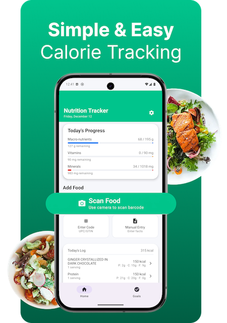
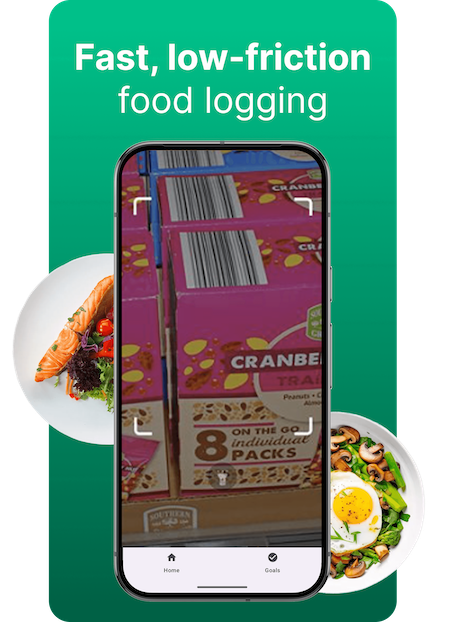
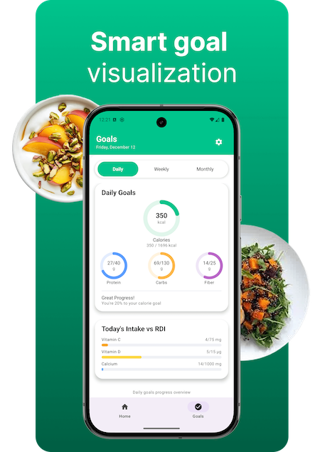
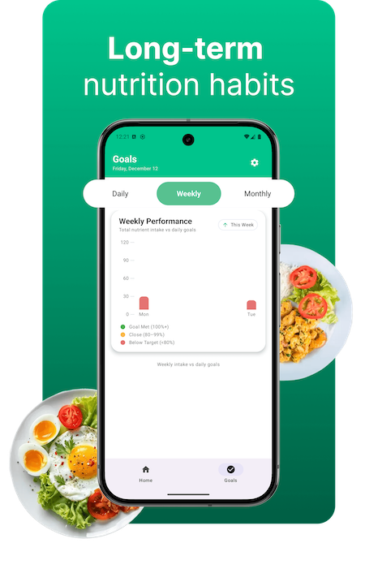
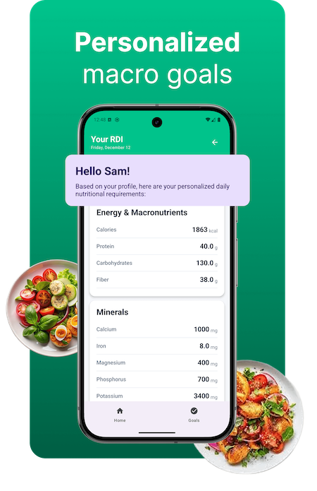
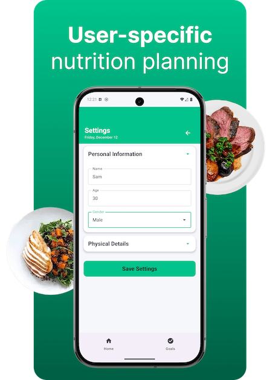

# Nutrition Tracker 🥗

> **Academic Disclosure:** *Built for CS 639 Mobile App Development at Pace University — Fall 2025. Post-submission, I continued to refine the UI and clean up the codebase as part of my portfolio.*

<br>

## My Contributions

This was a 3-person team project. I owned the **full design-to-frontend pipeline**:

- 🎨 **UI/UX Design** — Designed the entire app in Figma, from low-fi wireframes to a polished high-fidelity prototype
- 📱 **Frontend Development** — Built all screens in Kotlin + Jetpack Compose, translating the Figma designs into working UI
- 🗄️ **Room Database** — Implemented local data persistence for logged meals and nutrition entries
- 🖼️ **Visual Identity** — Defined the color system, typography, and component library used throughout the app

My teammates handled: barcode scanning (ML Kit) and USDA API integration (Retrofit) — Spencer; database architecture — Jash.

---

## About

NutritionTracker helps you build sustainable, healthy habits through simple and accurate food and macro tracking. Log meals in seconds, monitor your calories and key nutrients, and stay aligned with your daily goals — all in one place.

Whether you want to eat more balanced meals, improve your energy levels, or better understand what fuels your body, NutritionTracker makes mindful eating effortless.

**Your nutrition, simplified.**

---

## Design

Full UI/UX prototype designed in Figma — from wireframes to final high-fidelity screens:

🔗 [View Figma Design](https://www.figma.com/design/sHoKDqTynqJLP5thdN4s3J/Focusme-app?node-id=0-1&t=l7j3yRXpGCLyJl20-1)

---

## Screenshots

| Simple & Easy Calorie Tracking | Fast, Low-Friction Food Logging | Smart Goal Visualization |
|---|---|---|
|  |  |  |

| Long-Term Nutrition Habits | Personalized Macro Goals | User-Specific Nutrition Planning |
|---|---|---|
|  |  |  |

---

## Features

- Log meals quickly with an intuitive, clean interface
- Track calories, macros, and nutrients with real-time progress
- View daily, weekly, and monthly goal summaries
- Scan food items using barcode scanning (ML Kit)
- Access verified nutrition data via the USDA FoodData Central API
- Personalized daily nutrient targets based on your profile
- Smart charts and dashboards for insights

---

## Tech Stack

| Technology | Role |
|---|---|
| **Kotlin + Jetpack Compose** | UI and app logic |
| **Google ML Kit — Barcode Scanning** | Scan food package barcodes |
| **USDA FoodData Central API** | Fetch verified nutrition data |
| **Retrofit** | API communication |
| **Room Database** | Local storage for logged meals |
| **DataStore** | User goals and settings persistence |

---

## How to Run

1. Clone the repo
2. Open the `NutritionTracker` folder in Android Studio
3. Add your USDA API key to `local.properties`:
   ```
   USDA_API_KEY=your_key_here
   ```
4. Run on an emulator or physical device (API 26+)

Get a free USDA API key at [fdc.nal.usda.gov](https://fdc.nal.usda.gov/api-guide)

---

## Team

| Name | Role |
|---|---|
| [Anel Bazarbayeva](https://github.com/anelbazarbayeva95) | UI/UX Design + Frontend (Jetpack Compose) + Room Database |
| [Spencer Maginsky](https://github.com/SpencerMaginsky1) | USDA API Integration + Barcode Scanning |
| [Jash Berawala](https://github.com/JashBerawala) | Database Architecture |

---

## What I Learned

- Designing for mobile constraints — translating Figma prototypes into pixel-accurate Compose layouts
- Working with asynchronous data flows and state management in Jetpack Compose
- Collaborating across a full-stack team with defined ownership boundaries
- Debugging UI issues introduced during backend integration and refactoring
